## Features overview

### Control of stepper motor with rotating arm with attached IR and VIS camera

Instructions for building the arm can be found [here](https://github.com/Machriam/PlantMonitor/wiki/Motor-Circuit).  
Instructions for using the cameras can be found [here](https://github.com/Machriam/PlantMonitor/blob/main/Confluence/Setup/ImageTaking.md).  
Instructions for setting up the WLAN and the gateway server can be found [here](https://github.com/Machriam/PlantMonitor/blob/main/Confluence/Setup/Install.md).

### Review photo tours 
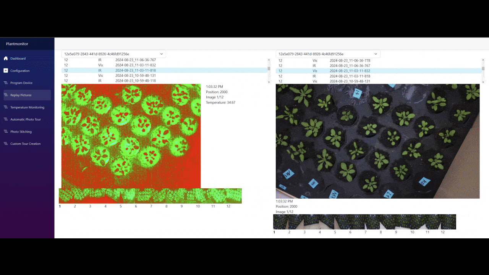

IR and VIS photos are taken at specified intervals for specified positions and can be replayed at any time.

### Add named plants to trip and define plant positions
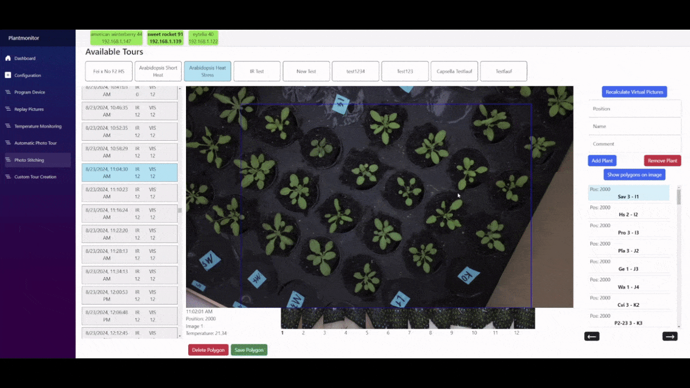

Cut polygons of plants will be used for all subsequent photo trips unless a new polygon is defined.  
A trip shows the number of polygons defined in that trip.  
The blue frame indicates the field of view of the IR camera defined by the global alignment.

### Create virtual photos of all plants 
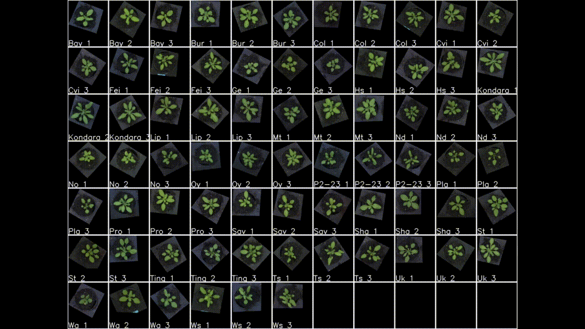

1. Raw data from virtual images can be exported with metadata for use in other imaging software.
2. Previously defined alignments and plant positions are overlayed pixel perfectly
3. 3 virtual images with the same dimensions and spacing are exported as png within a zip file. The zip file also contains a metadata file:
   1. VIS image 
   2. An IR image with a human-friendly color spectrum
   3. A raw IR image where the layers define the integer and fractional values of the temperature at the corresponding pixel. 

### Create automatic summaries of plant growth and visualize it dynamically
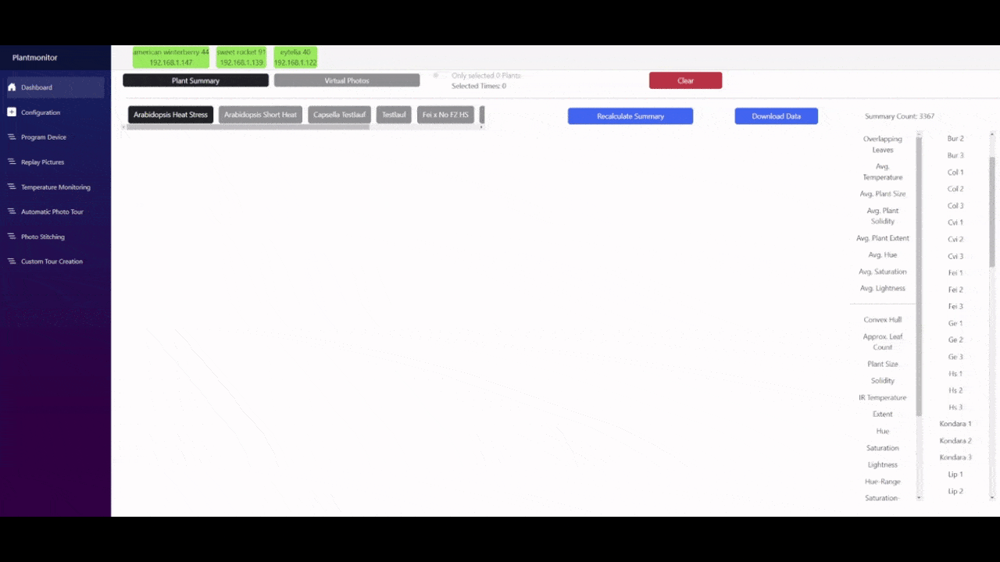

Summary data of plant growth can also be exported for use in other visualisation software.

### Mark points of interest in the summary and review plant development
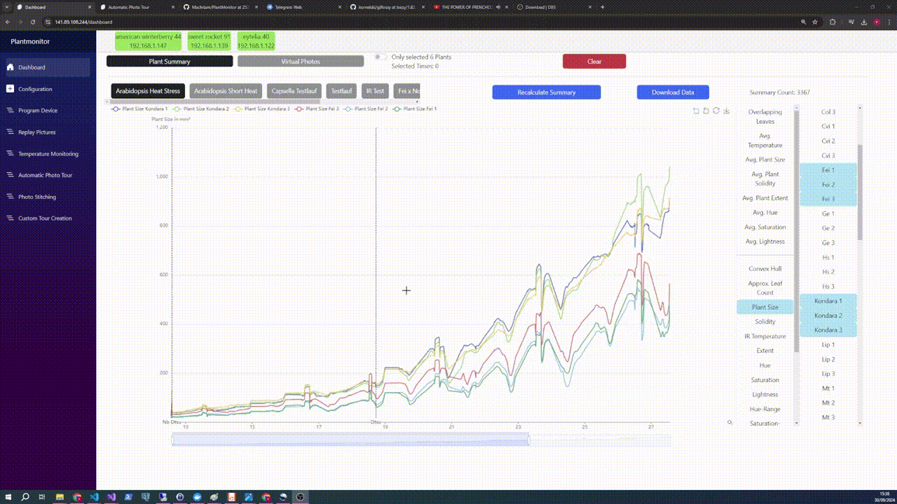

### Zoom in on specific plants
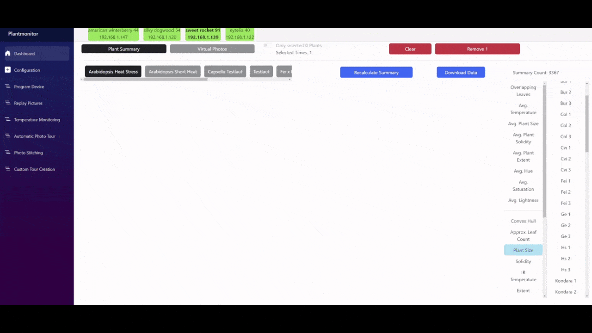

The dotted black vertical bars in the summary indicate a change in segmentation strategy.

#### Fine-tune segmentation parameters with live preview
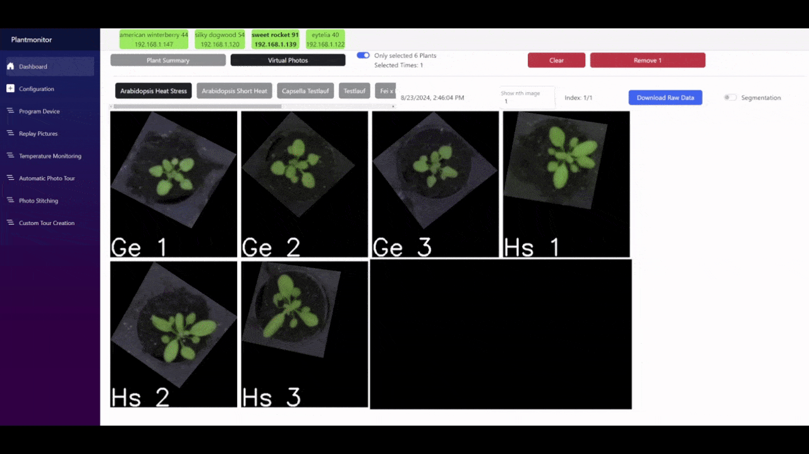

White areas are used to calculate the image descriptors displayed in the summary. You can recalculate all virtual photos and summaries at any time.  
A photo tour can define several different segmentation parameters. Different growth stages require different segmentation strategies.  
New segmentation parameters are applied to all subsequent photo trips within a photo tour.

#### Define Custom Photo Tours
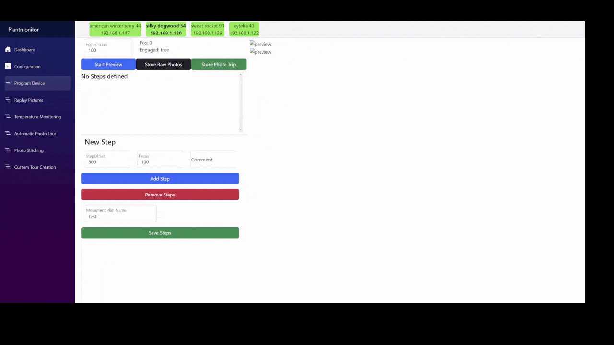

A defined movement can be tested beforehand using the "Start Preview" button and the movement buttons to the right of each step.  
A photo tour may be stopped and resumed at any time and the interval between photo trips can be changed to be more or less frequent during heat stress or night time.

### Define IR and VIS alignment per plant for optimal temperature measurements
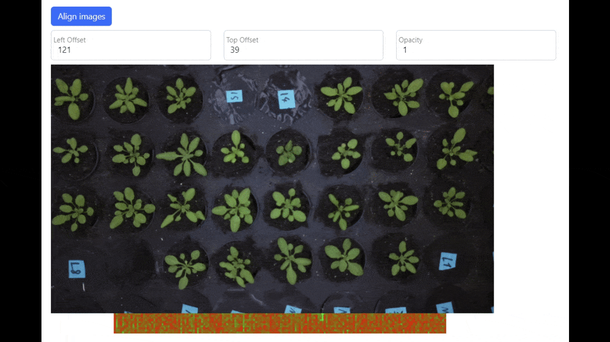

Global alignment of VIS and IR image

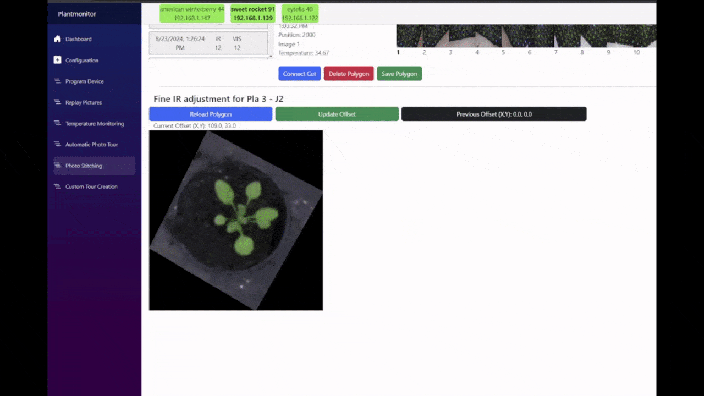

Fine alignment of VIS and IR image for each individual plant.  
Fine alignments are used for all subsequent photo trips unless redefined in another trip.

### Find automatically new devices and deploy with one click
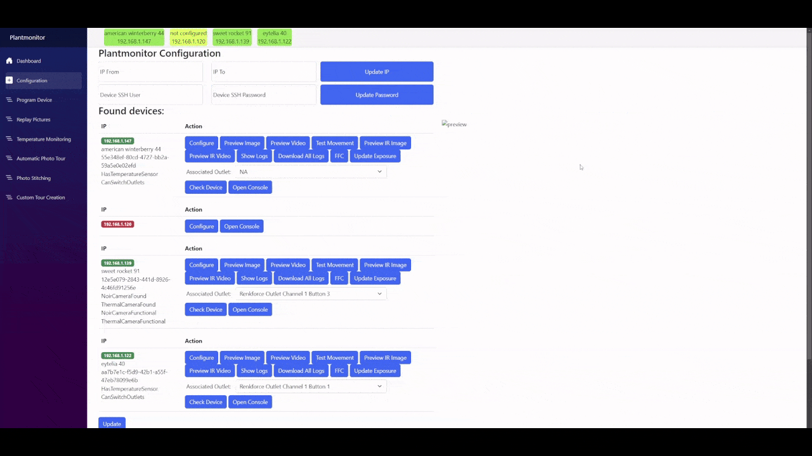

Deployment time is around 2-3 minutes on a Raspberry Pi Zero 2W

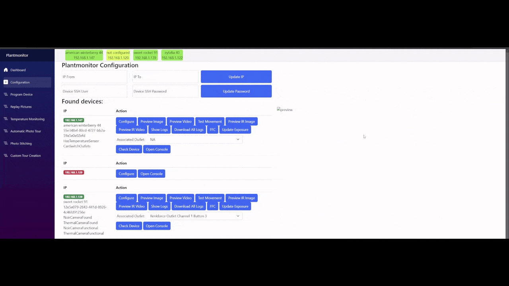

Deployments run in the background. Even if the connection is lost, the deployment will continue.

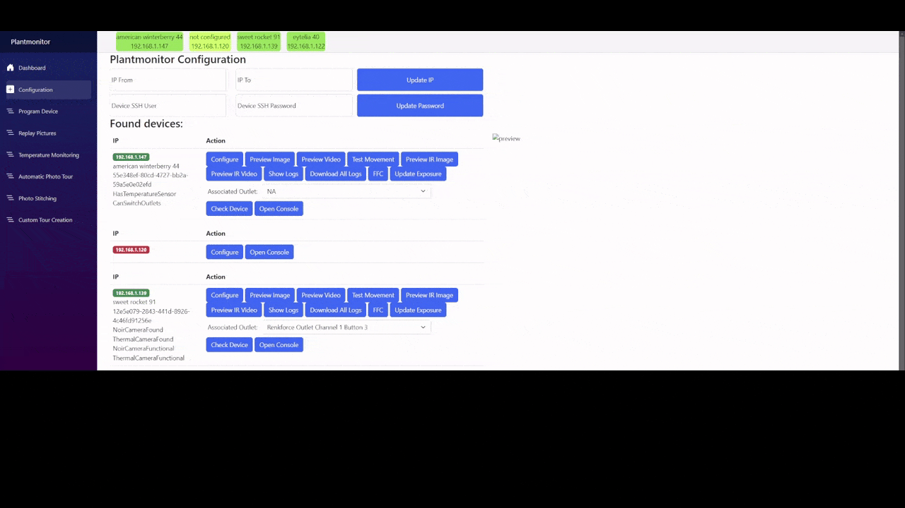

Developer-friendly features for diagnosing device malfunctions via SSH. Each device has multiple buttons to check log entries, test image capture functionality, and define custom exposures for photo tours.

### Use external measurement devices like ADT7422

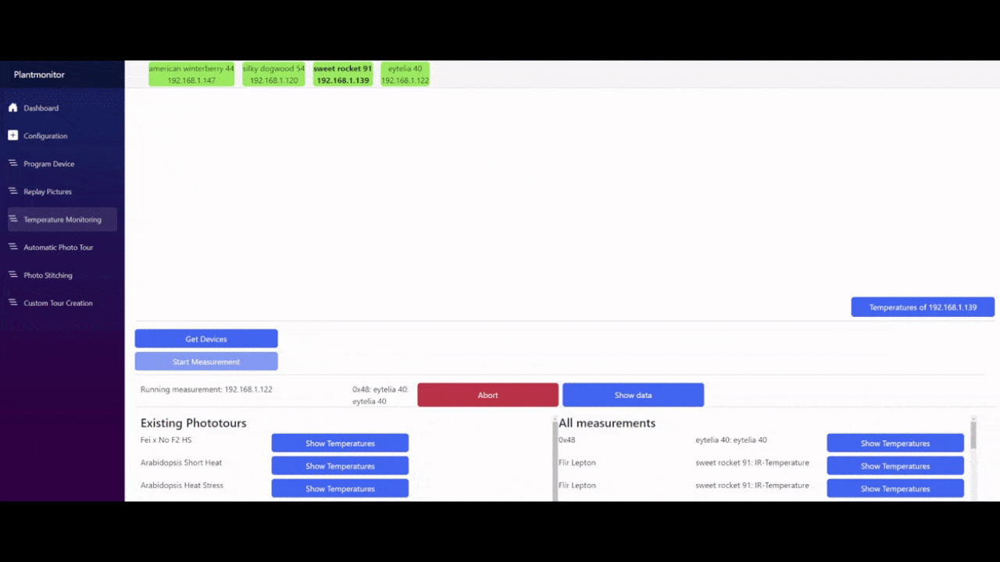

See issue [88](https://github.com/Machriam/PlantMonitor/issues/88) for more information. 

### Create photo tours with minimal delay between trips

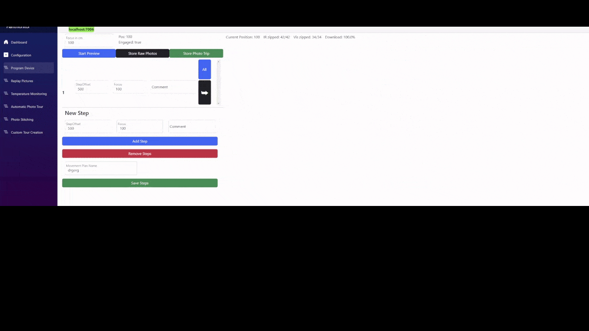

Depending on the setup, a Raspberry Pi Zero 2W can capture IR and VIS images at around 2-4 FPS.    
This feature takes images as fast as possible and downloads a zip archive of the data. For a 30 minute measurement at 2 FPS, it will download a zip of about 7 GB. Zipping and downloading the zip archive takes between 1 and 2 hours, depending on internet speed.   
You can then create a custom photo tour from this archive, and all the features mentioned above are supported.
This feature is highly hackable, as the motor can be moved while taking pictures and user supplied FFC requests can be issued.
