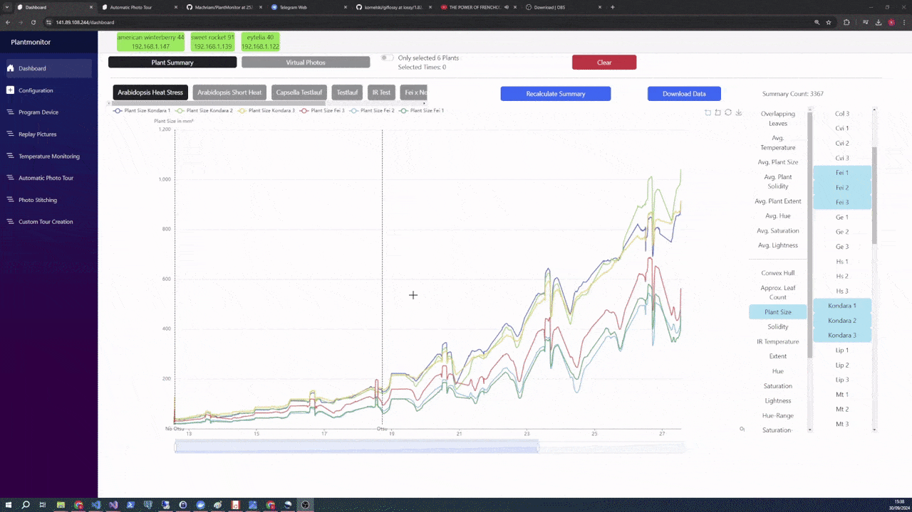

## Feature Overview

#### Control stepmotor with rotating arm with IR- and VIS-camera attached

#### Define photo tours 

IR- and VIS-photos are taken in specified intervalls for specified positions and can be replayed any time.

#### Add named plants to trip and define plant positions

#### Define IR- and VIS-alignment per plant for optimal temperature measurements

Global alignment of VIS- and IR-image

Fine alignment of VIS- and IR-image for each plant individually

#### Create virtual photos of all plants 

1. Raw data of virtual images can be exported with corresponding metadata for usage in other imaging software.
2. Previously defined alignments and plant positions are overlayed pixel perfectly
3. 3 virtual images with equal dimensions and spacing are exported as png:
   1. VIS-image 
   2. An IR-image with a human friendly color spectrum
   3. A raw IR-image were the layers define the integer and fraction values of the temperature at the corresponding pixel 

#### Create automatic summaries of plant growth and visualize it dynamically

Summary data of plant growth can be exported aswell for usage in other visualization software.

#### Mark points of interest in the summary and review plant development

#### Find automatically new devices and deploy with one click

Deploy time is around 2-3 minutes for a Raspberry Pi Zero 2W

Deployments run in background. Even if connection breaks, deployment resumes.

Developer friendly features to diagnose malfunctions of devices via SSH. Each device has multiple buttons to check log entries, test image taking functionality and define custom exposures for phototours.