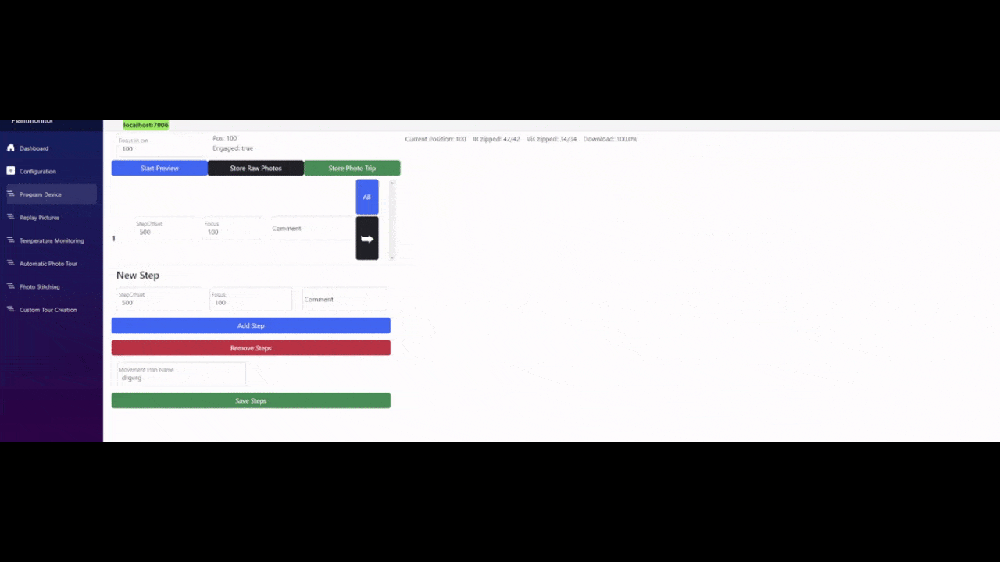
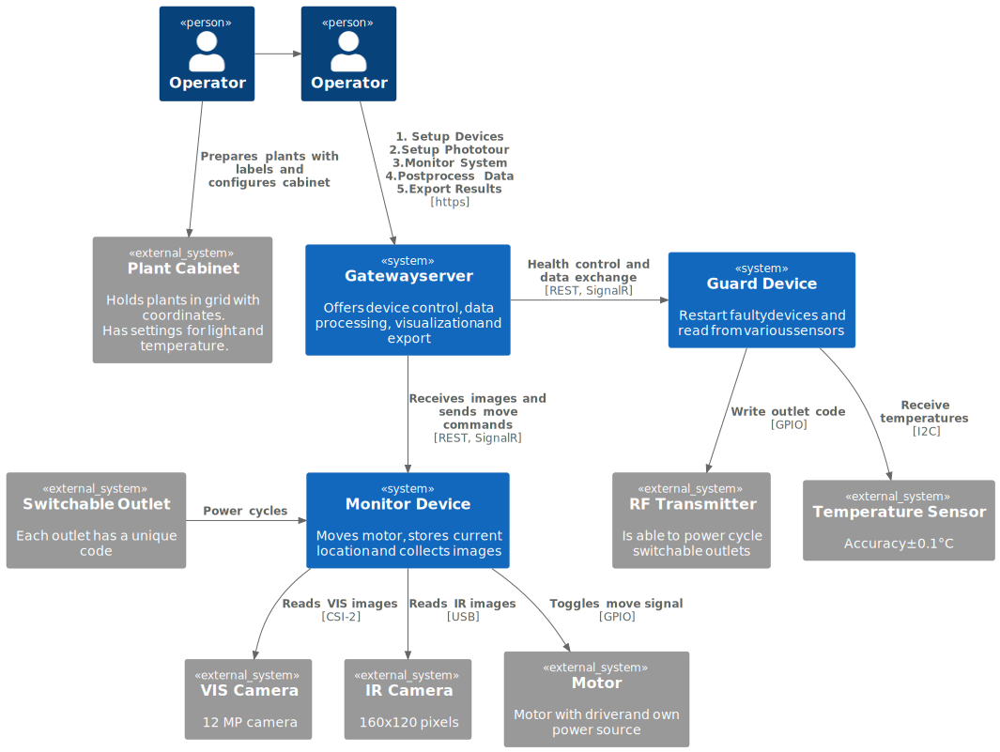

## Goal of the project

1. **Live Results:** Making it easy to monitor the growth process and plant-specific behaviors like bending of the leaves during heat stress events as soon as they are happing.
2. **From image to graph:** This is an all-in-one solution, meaning that you build the hardware and the software does the calibration, image acquisition, data processing, and display of the image results.
3. **Highly customizable:** This software can also monitor anything else, as the segmentation is highly customizable and the user decides what to look at.
4. **Open Data:** Plantmonitor provides easy access to all raw data collected during an experiment in easy self-describing formats.
5. **Cross-Platform:** This is a web-based project and any device with a browser can be used to control the experiment and monitor the current status.

## Features overview

### Control of stepper motor with rotating arm with attached IR and VIS camera

- Instructions for building the arm can be found [here](https://github.com/Machriam/PlantMonitor/wiki/Motor-Circuit).
- Instructions for using the cameras can be found [here](https://github.com/Machriam/PlantMonitor/blob/main/Confluence/Setup/ImageTaking.md).
- Instructions for setting up the WLAN and the gateway server can be found [here](https://github.com/Machriam/PlantMonitor/blob/main/Confluence/Setup/Install.md).
- Building the arm requires some assembly and soldering skills. If you do not need the rotation part, you can omit the assembly part and use the software without a movement plan (only 1 fixed position to move to).

### Define photo tours

- These are the images taken during a single photo trip.
- IR and VIS photos are taken at specified intervals for specified positions and can be replayed at any time.
- All images are stored directly on the filesystem for easy access.
- You can use the status buttons of the devices in the top bar to easily select the folder containing images of the selected device.
- You can use the scroll wheel or the below image preview to navigate images.

- In the above gif, you can see the definition of a new movement plan with various offsets to move to. The camera currently uses only the input of the first focus field.
- The used movement plan is shown when a new photo tour is created.
- A defined movement plan can be tested beforehand using the "Start Preview" button and the movement buttons to the right of each step.
- With the "All" button, all movement buttons are pressed one after another, simulating a whole trip.
- With the "Save Photo Trip" button, you can also store the whole trip. The images are stored in full size, therefore no preview is shown. However, it displays the transmitted images after the trip, so that the user sees when the transmission has finished.
- A photo tour may be stopped and resumed at any time and the interval between photo trips can be changed to be more or less frequent during heat stress or nighttime.

### Add named plants to trip and define plant positions

- Cut polygons of plants will be used for all subsequent photo trips unless a new polygon is defined.
- A trip shows the number of polygons defined in that trip.
- The blue frame indicates the field of view of the IR camera defined by the global alignment.
- The global alignment is used from the selected device in the top bar.
- The polygons are used for the creation of virtual images. Virtual images are not recalculated upon changing polygons. Press the "Recalculate Virtual Pictures" button to recalculate virtual images and the corresponding plant summaries.

### Define IR and VIS alignment per plant for optimal temperature measurements

- Global alignment of VIS and IR images. This feature is found in the Replay Pictures menu. You have to select a VIS image on one side and an IR image on the other side. Then you can align those images by clicking "Align images".
- For easier alignment, it is recommended to overlay images taken during heat stress or cool down.
- Leaves of plants heat up and cool down more quickly than the surrounding area. This means that it is easier to distinguish leaves from the background during those events.

- Fine alignment of VIS and IR images for each individual plant.
- Fine alignments are used for all subsequent photo trips unless redefined in another trip.
- Offsets can be adjusted by using the arrow keys on the keyboard.

### Create virtual photos of all plants

- Raw data from virtual images can be exported with metadata for use in other imaging software. ("Download Raw Data" button in the dashboard)
- Previously defined alignments and plant positions are overlaid pixel perfectly.
- 3 virtual images with the same dimensions and spacing are exported as PNG within a zip file. The zip archive contains the following files:
  1. VIS image
  2. A rainbow IR image with a human-friendly color spectrum
  3. A raw IR image where the layers define the integer and fractional values of the temperature at the corresponding pixel.
  4. A TSV file, which stores the sensor data during that trip and all required metadata to process the images (Internally, nothing more than the contents of those zip archives is used to calculate the summaries.)

### Create automatic summaries of plant growth and visualize it dynamically

- You can switch between photo tours with the black buttons on top of the chart. Currently, "Arabidopsis Heat Stress" is selected. When selecting a photo tour, the summary data is downloaded to the browser for fast dynamic display of the plant descriptors.
- On the right side, you can select which descriptors you want to see for which plant. There are also global descriptors, which show the average over all plants, like "Avg. Temperature".
- Especially "Overlapping Leaves" can be important. This shows how many polygons should be recut to contain the whole plant, as their leaves have grown out of bounds of the initial polygon.
- You can scroll in the chart to zoom in or out of data points.
- Summary data of plant growth can also be exported for use in other visualization software. Press "Download Data" to get a zipped JSON export of the data.

### Mark points of interest in the summary and review plant development

- In the "Virtual Photos" tab, you can download all virtual images in a zip archive. Zipping all virtual images takes a while and this runs in the background. A 3-week long photo tour with a trip interval of 4 minutes generates around 36 GB of virtual image data.
- Press "Download Raw Data" to start the download process.
- The zip archives of the virtual images contain all the information to run your own image processing pipeline in other software.

### Zoom in on specific plants

- Sometimes it is hard to see plants of interest in the whole virtual image. You can only display the selected plants in the plant summary via one click.
- The dotted black vertical bars in the summary indicate a change in the segmentation strategy.

#### Fine-tune segmentation parameters with live preview

- White areas are used to calculate the image descriptors displayed in the summary. You can recalculate all virtual photos and summaries at any time by clicking "Recalculate Summary".
- A photo tour can define several different segmentation parameters. Different growth stages require different segmentation strategies.
- New segmentation parameters are applied to all subsequent photo trips within a photo tour.
- This feature makes it possible to segment anything. You can change the hue range to only segment blue, red, or yellow parts in the image. This means you can measure the size of anything, as long as it is visibly distinguishable from the background.
- The current version also features a particle filter.
- Here you can find a description of [Opening](https://en.wikipedia.org/wiki/Opening_(morphology)) and [Otsu](https://en.wikipedia.org/wiki/Otsu%27s_method).

### Find automatically new devices and deploy with one click

- Managing software on IoT devices is usually a hassle, but with WebSSH you can configure new devices with one click.
- Follow this [guide](https://github.com/Machriam/PlantMonitor/blob/main/Confluence/Setup/Install.md#raspberry-pi-zero-2w-installation) for the initial setup of the Raspberry Pi.
- Configure the gateway server with the "Update IP" button to listen on the IP range of the devices.
- Configure the correct SSH user and password with "Update Password" to allow the gateway server to log in to the devices.
- Press the "Configure" button and after around 2-3 minutes the setup should be finished.
- You should be able to use any Raspberry Pi with at least the processing power of a Raspberry Pi 3 / Raspberry Pi Zero 2.

- Deployments run in the background. Even if the connection is lost, the deployment will continue.
- This is achieved by using tmux as a terminal multiplexer. The first thing the "Configure" button will do is to ensure that tmux is installed.
- When tmux has been started, the black screen will flash once, and then you should be able to reconnect at any time by typing "tmux attach" in the console.

- Developer-friendly features for diagnosing device malfunctions via SSH.
- In the gif, you can see that you can run any Unix command you want in the console for monitoring various things and install additional packages you may require.
- Each device has multiple buttons to check log entries, test image capture functionality, and define custom exposures for photo tours:
  1. "Preview Image" stops any running VIS video streams and shows a small preview image of the VIS camera.
  2. "Preview Video" stops any running VIS video streams and shows a small preview video of the VIS camera.
  3. "Test Movement" moves the motor 1500 pulses in a direction. Ensure that nothing might break during the movement.
     **Warning:** Verify that the pulse/revolution setting is set correctly.
  4. "Preview IR Image" stops any running IR video streams and shows a small preview image of the IR camera.
  5. "Preview IR Video" stops any running IR video streams and shows a small preview video of the IR camera.
  6. "Show Logs" displays the most recent logs below all other windows on the right side.
  7. "Download All Logs" downloads all logs on the device. Devices are logging many steps, so diagnosing issues might be worthwhile.
  8. "FFC" issues a flat field correction to the IR camera. This improves the resolution of the temperature readings.
  9. "Update Exposure" takes a test image with automatic exposure and stores the automatically determined exposure for all future image taking. This ensures that during a photo trip each location takes a photo with the same exposure settings.

### Use external measurement devices like ADT7422

- You can display live temperatures taken from the sensor in a chart by clicking "Temperatures of %Selected-IP%".
- Under "Existing Phototours", temperature measurements of the corresponding photo tour can be viewed.
- Custom measurements can be created by clicking "Start Measurement" and aborted at any time. Under "All measurements", stored temperatures from custom measurements can be viewed in the diagram.

See issue [88](https://github.com/Machriam/PlantMonitor/issues/88) for more information on implementation details.

### Create photo tours with minimal delay between trips - Custom tours

- Depending on the setup, a Raspberry Pi Zero 2W can capture IR and VIS images at around 2-4 FPS.
- You can start a custom tour by clicking "Store Raw Photos". You can see a summary of how many images were taken and the current zipping progress.
- As soon as enough images have been taken, click "Stop Preview" to stop the image-taking process and wait until all images are zipped, downloaded to the server, and downloaded to the browser.
- This feature takes images as fast as possible and downloads a zip archive of the data. For a 30-minute measurement at 2 FPS, it will download a zip of about 7 GB. Zipping and downloading the zip archive takes between 1 and 2 hours, depending on internet speed.
- The downloaded zip can then be used to create a custom photo tour under "Custom Tour Creation". All features to process a conventional photo tour are supported.
- This feature is highly hackable, as the motor can be moved while taking pictures and user-supplied FFC requests can be issued.

### Glossary

| Word            | Definition                                                                                                                                                                                                 |
|-----------------|-------------------------------------------------------------------------------------------------------------------------------------------------------------------------------------------------------------|
| Photo tour      | A photo tour is a collection of photo trips. A photo tour defines the interval between each photo trip and which devices and sensors should participate in the creation of trips.                             |
| Photo trip      | A photo trip or trip for shot is a single run of a photo tour. A photo trip contains all the images taken during that trip as defined in the used movement plan.                                              |
| Movement plan   | Contains the definition of all positions the motor should move to during a photo trip. At each location, the motor stops and the configured cameras take an image of the location. The best IR and VIS image is taken after the IR camera has issued an FFC. |
| Movement Offset | The motor moves in steps as configured by the driver. The movement plan uses those step offsets to move relative to the current position.                                                                    |
| Poly/Polys      | Short name for Polygon/Polygons.                                                                                                                                                                            |
| Polygon         | Plantmonitor must know which plants exist and from which camera position and coordinates to take them. This is where the user can define polygons or cuts on the image, which are then used for further processing. |
| Virtual image   | Each photo trip yields a virtual image. The virtual image consists of all polygons of plants taken during the corresponding trip.                                                                            |
| IR image        | Infrared image, which is capable of holding the temperature information inside the pixels.                                                                                                                   |
| VIS image       | Your normal image taken with a camera. VIS means visible as in visible light.                                                                                                                                |
| Raw IR          | The raw IR image is added to the zip archive containing the virtual image in VIS and rainbow IR. The raw IR contains the temperature information in a computer-readable form (PNG, with 1 layer for integer values and 1 layer for fractional values of the temperature). |
| Rainbow IR      | This is the human interpretable form of the temperature data.                                                                                                                                                |
| FFC             | Flat field correction. This is used to calibrate the IR camera for proper temperature measurements.                                                                                                          |
| Global Alignment| The IR and VIS cameras are spaced apart and have different fields of view. Global alignment is a rough estimate provided by the user to correct this. Correction means to superimpose VIS and IR images as best as possible. |
| Fine Alignment  | Global alignment can never be exact. Therefore, fine alignment is required for each plant. Each individual plant is superimposed on the VIS and IR images as best as possible.                            |
| Custom Tour     | Is a hacked photo tour, which takes photos as fast as possible without reading sensors or moving automatically. The resulting zip can be imported as a usual photo tour, where each combination of taken IR and VIS images creates a trip. |

## Architecture Overview

Implementation details of various features can be found in the issues of the project.

### Context Diagram

- It is recommended to use a grid-like positioning system in the plant cabinet. For example, a plywood board with holes for the plants and coordinate numbers on the sides is advantageous.
- The guard device is optional, but it makes it possible to run photo tours for several weeks without manual intervention. The guard device requires an RF transmitter and switchable outlets to listen to those RF transmitters. The gateway server automatically restarts non-functioning devices when a guard device is present and properly configured.
- See this [issue](https://github.com/Machriam/PlantMonitor/issues/93) for instructions on how to build the guard device and how to extract RF codes for switchable outlets.

### Container Diagram

- The frontend is implemented as a single-page application, which gives an IDE-like experience for the user.
- WebSSH is an embedded package into the frontend. This means authentication is done separately, as it is the only component that communicates directly with the devices. All other calls to the devices are handled by the gateway server.
- The gateway server consists of several workers, all of which run independently depending on the state of the database/filesystem. Typically, these workers poll the database for things to do. Race conditions are not possible, as the state responsible for other workers to start is written at the final stage of each worker.
- In a development build, the API of the gateway server can be tested with Swagger. The TypeScript client for the frontend is created automatically from the API endpoints. The database schema is scaffolded via EF Core with an unit testable IDataContext interface.
- Workers use OpenCV via Emgu CV for image processing. This requires a custom build of OpenCV. The script [SetupGatewayMachine.sh](https://github.com/Machriam/PlantMonitor/blob/main/Confluence/Setup/SetupGatewayMachine.sh) automatically builds a suitable OpenCV image for this. This script also creates a new ssl certificate for the devices and the gatewayserver. All devices use the same certificate to minimize certificate installation for users. That is why desired IP addresses must be specified during setup of the gateway server. By default all IPs from 192.168.0.0 to 192.168.1.255 are reserved for gateway server and devices.
